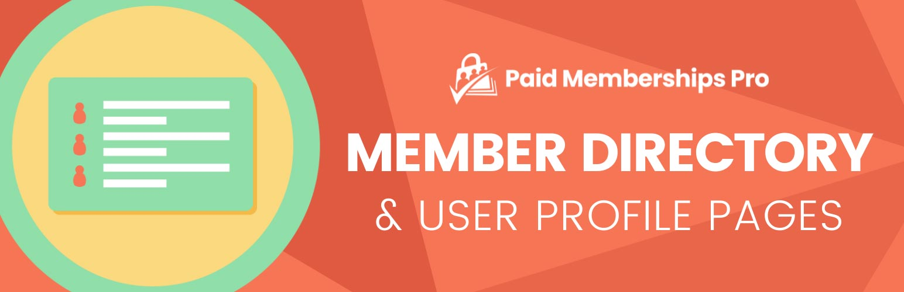

# [Member Directory and Profile Pages](https://www.paidmembershipspro.com/add-ons/member-directory/) #
[comment]: # (Generate badges from shields.io, only works for .org plugins to get other stats etc. We'd have to create our own endpoints for Premium plugins)

### Welcome to the Member Directory and Profile Pages GitHub Repository
Add a robust Member Directory and Profiles to Your Membership Site - with attributes to customize the display.

For more information please visit [paidmembershipspro.com/add-ons/member-directory/](https://www.paidmembershipspro.com/add-ons/member-directory/)

## Installation ##
For detailed installation steps, visit the [documentation](https://www.paidmembershipspro.com/add-ons/member-directory/) page.

1. Download the current development ZIP file directly: `https://github.com/strangerstudios/pmpro-member-directory/archive/dev.zip`

**Please ensure that once installing this version of the plugin to remove `-dev` from the plugin's folder name.**

## Bugs ##
If you find an issue/bug, let us know by [creating a detailed GitHub issue](https://github.com/strangerstudios/pmpro-member-directory/issues/new).

## Support ##
This is a developer's portal for Member Directory and Profile Pages. We do not offer support on this channel. **Any support related questions should be directed to [paidmembershipspro.com/add-ons/member-directory/](https://www.paidmembershipspro.com/add-ons/member-directory/).**

## Contributing to Member Directory and Profile Pages ##
We encourage and welcome any contribution to Member Directory and Profile Pages. Please read the [guidelines for contributing](https://github.com/strangerstudios/paid-memberships-pro/blob/dev/.github/CONTRIBUTING.md) to this repository.

There are various **ways to the help development** of Member Directory and Profile Pages:

1. Report [bugs/issues](https://github.com/strangerstudios/pmpro-member-directory/issues/new) on GitHub.
2. Work on any issues by submitting a Pull Request.

Here are some ways for **non-developers to contribute** to Member Directory and Profile Pages:

1. Translate Member Directory and Profile Pages into your own [language](https://www.paidmembershipspro.com/paid-memberships-pro-in-your-language/).
2. [Purchase a paid membership](https://paidmembershipspro.com/pricing) to help fund ongoing development and bug fixes.
